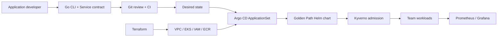

# Self-Service Developer Platform on EKS

> Personal portfolio project, validated in short-lived disposable EKS
> environments—not employer production operation. The repository records what
> was observed, what was only designed, and what remains unverified. It does
> not claim to be production-proven, enterprise-ready, or battle-tested.

## The problem and the user

Application developers should not have to independently assemble Deployments,
Services, probes, disruption budgets, security contexts, resource policies,
deployment automation, and monitoring for every service. This platform offers
a small, reviewable service contract and a Golden Path:

```text
Service Definition -> contract/policy CI -> Git review -> ApplicationSet
-> Helm Golden Path -> Kubernetes admission -> observed application
```

The developer owns application intent: image, port, team, environment,
resource size, replica count, health paths, and bounded autoscaling. The
platform owns the repeatable Kubernetes structure and guardrails.

## What the Golden Path produces

A `platform.example.io/v1alpha1` Service Definition is validated by the Go CLI
and JSON schema. Argo CD discovers it with ApplicationSet and Helm renders a
Deployment, ClusterIP Service, PDB, and optional HPA. Defaults include:

- readiness/liveness probes and a zero-unavailable rolling update;
- CPU/memory requests and limits from named sizes;
- non-root execution, RuntimeDefault seccomp, no privilege escalation, dropped
  capabilities, read-only root filesystem, and no service-account token;
- ownership/environment labels and optional Prometheus scraping.

Arbitrary PodSpec fragments and `extraObjects` are intentionally excluded.
See [Platform Contract](docs/PLATFORM_CONTRACT.md) and
[Golden Path](docs/GOLDEN_PATH.md).

## Safety and ownership boundaries

| Layer | Protection | Boundary |
| --- | --- | --- |
| Contract/CLI | rejects unknown teams, invalid names, untagged/`latest` images, invalid sizes/ports/replicas | cannot prove an image exists or an app starts |
| CI policy | tests the same Kyverno policies before merge | feedback, not the authoritative runtime gate |
| Admission | eight Enforce-mode policies reject unsafe Pods in EKS | policy-valid runtime failures remain possible |
| GitOps | reviewed desired state, drift detection, prune and self-heal | no automatic semantic rollback of a bad Git revision |
| Team RBAC | own-namespace read/log/port-forward; workload writes withheld | namespace is not hostile-tenant isolation |
| Observability | request/error/latency/availability signals and standard dashboard | monitoring can fail independently; no external alert route |

The important distinction is deliberate: platform controls reduce classes of
failure; they do not make application revisions infallible. Phase 4 exercises
these boundaries in [Intentional Failure Experiments](docs/FAILURE_EXPERIMENTS.md).

## Architecture and deployment



Terraform owns the AWS/EKS foundation. Helm and Argo CD own cluster workloads;
Terraform does not own application Deployments. Bootstrap scripts install
pinned Argo CD, Kyverno, and kube-prometheus-stack releases. Creation is kept
out of CI because the environment is deliberately cost- and approval-bounded.
See [Architecture](docs/ARCHITECTURE.md) and the ADRs in `docs/adr/`.

## Validation evidence

The strongest evidence is behavior, not technology count:

- real EKS create/use/destroy cycle with state zero and AWS API residual checks;
- GitOps reconciliation plus manual-drift self-heal;
- live Kyverno admission rejection backed by CI fixtures;
- positive and negative team RBAC checks on EKS;
- Prometheus targets, application metrics, SLI queries, and Grafana dashboard
  data on the disposable cluster;
- GitHub Actions OIDC positive/negative tests without long-lived AWS keys;
- unexpected cloud integration incidents retained with diagnosis and fixes.

Phase 4 then deliberately broke platform boundaries on a fresh EKS cluster:
bad image and Argo-controller experiments were **PARTIAL** because normal Argo
refresh exceeded expectations and needed hard refresh; Prometheus loss and
team-boundary experiments **PASS**. In every measured application-serving
window, 50/50 requests returned HTTP 200. These short samples demonstrate
failure behavior, not production availability. Destroy passed; direct residual
APIs were empty, while the tagging index retained a deleted-NAT tombstone, so
the residual verdict remains PARTIAL.

Exact commands, dates, qualifications, and PASS/PARTIAL/NOT RUN states live in
[Validation](docs/VALIDATION.md). Unexpected implementation incidents are in
[Incidents](docs/INCIDENTS.md); intentional failure injections are kept apart
in [Failure Experiments](docs/FAILURE_EXPERIMENTS.md). Never infer a PASS from
architecture or from a previous phase.

## What failed in real AWS

Local rendering did not expose every integration problem. Real runs found EKS
node-join/security-group behavior, an Argo CD source affected by `.gitignore`,
an invalid Trivy Action release, a customized GitHub OIDC subject, a stale
Terraform plan, API-server-to-Kyverno webhook connectivity on port 9443,
bootstrap version-check behavior, and CRD client-dry-run discovery behavior.
The repository preserves symptoms, cause, correction, and rerun evidence
instead of presenting a frictionless success story.

## Try the contract and local checks

```bash
make build
./platform create-service \
  --name example-api \
  --owner payments-team \
  --environment dev \
  --contact payments-team@example.com \
  --image ghcr.io/example/example-api:v1.2.3 \
  --port 8080
./platform validate services/payments-team/payment-api/service.yaml
make validate
```

`make validate` runs Go tests/vet, contract validation, Terraform fmt/validate,
Helm lint/render, kubeconform when installed, GitOps rendering, Kyverno tests,
observability checks, Trivy when installed, and a Docker build when available.
Missing optional tools are reported as NOT RUN rather than silently counted.

The reusable Phase 4 runner is intentionally guarded and sequential:

```bash
AWS_PROFILE=portfolio make phase4-baseline
bash scripts/phase4-experiments.sh  # prints available actions
```

## Repository map

```text
cmd/platform/             CLI entry point
internal/                 contract, commands, structural tests
schemas/                  versioned Service schema
charts/golden-path/       standard workload templates
services/                 team-owned application intent
gitops/                   bootstrap, AppProject, ApplicationSet, team RBAC
policies/                 Kyverno policies and fixtures
observability/            Prometheus values/rules and Grafana dashboard
infra/                    disposable AWS foundation
scripts/                  validation, bootstrap, experiments, destroy
docs/                     evidence, runbooks, decisions, interview guide
```

## Limitations

This is a two-team personal demonstration on a shared, short-lived cluster.
It does not prove long-running operations, organizational adoption, hostile
multi-tenancy, 30-day SLO compliance, disaster recovery, or scale to many
teams. Namespace/RBAC is an administrative boundary; nodes, networking and
cluster controllers remain shared. Alertmanager/routing, log aggregation,
secrets management, progressive delivery, databases, queues, service mesh,
multi-cluster, and multi-region are outside the implemented scope.

The sample Service definitions reference a digest from a disposable ECR run;
after destroy that reference is evidence of the tested revision, not a
currently deployable public image. A fresh validation run builds/pushes a new
image and commits its digest before bootstrap.

## Future production extensions

Potential next steps are recorded rather than implemented as a new feature
phase: remote Terraform state and locking, NetworkPolicy, ResourceQuota,
image signing/verification, real workforce identity integration, HA platform
controllers, independent alert routing, durable monitoring, staged policy
rollout, longer SLO evaluation, and explicit disaster-recovery objectives.
Priority should follow measured risk and organizational requirements.

## Cost and teardown

The disposable design uses an EKS control plane, two `t3.medium` nodes, one NAT
Gateway/EIP, EBS, ECR, CloudWatch, and the controllers on the same nodes; it has
no RDS, external LoadBalancer, GPU, or mesh. A short experiment is not a reliable
monthly billing estimate, and exact cost is claimed only when billing evidence
exists. Leaving the design running continuously can exceed USD 100/month.

Destruction is plan-first and requires explicit confirmation:

```bash
make destroy
```

Completion requires Terraform state to contain zero resources plus AWS API
checks for project EKS, node groups, EC2/ASG, VPC/subnets/NAT/EIP/ENI/SG/EBS,
ECR, CloudWatch, IAM roles, and project-created OIDC resources. No pre-existing
account resource may be deleted.

## Interview preparation

[INTERVIEW_GUIDE.md](docs/INTERVIEW_GUIDE.md) ties 20 likely questions to key
concepts, repository evidence, trade-offs, and follow-ups. It also states which
claims are safe and which would exceed the evidence.
