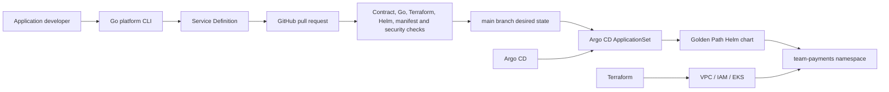

# Self-Service Developer Platform on EKS

> Personal implementation. A real AWS/EKS validation run was performed on
> 2026-09-22 JST against a disposable environment (EKS 1.35, `t3.medium` x2,
> single NAT, no RDS/LoadBalancer/mesh/GPU) and fully destroyed afterwards
> with zero residual project resources. Phase 3 adds guardrails, a second
> team, RBAC and observability; see [docs/VALIDATION.md](docs/VALIDATION.md)
> for what is validated vs. assumed. This is not production operation
> experience and is not described as production-ready.

This personal portfolio explores a Platform Engineering product: a small,
reviewable contract that lets an application developer request a safe standard
workload without authoring Kubernetes objects directly.

## Problem

Without a platform contract, every developer must repeatedly understand and
assemble Kubernetes Deployments, Services, probes, resource settings, disruption
budgets, security contexts, labels, and deployment tooling. The result is slow
onboarding and inconsistent safety.

## Platform users and product

The user is an application developer. The product is a Golden Path plus a
self-service interface:

```text
small Service Definition -> reviewed Git change -> standard Helm workload -> Argo CD reconciliation
```

The platform absorbs repeatable infrastructure choices. Developers retain the
application image, port, ownership, size, replicas, health paths, and bounded
autoscaling choices.

## Current status

| Capability | Implementation | Validation |
| --- | --- | --- |
| Service Definition v1alpha1 | Implemented (owner, environment, contact) | See validation record |
| Go CLI: create-service / validate / doctor | Implemented | See validation record |
| Golden Path Helm chart | Implemented | See validation record |
| Kyverno guardrails (8 ClusterPolicies) | Implemented, CI + admission share files | `kyverno test` cases A–E; live admission in EKS validation |
| Multi-team (payments, orders) + RBAC | Implemented | Structural Go tests; live `can-i` in EKS validation |
| Observability (Prometheus/Grafana, dashboard, SLO) | Implemented, minimal stack | Manifest/JSON tests; live data in EKS validation |
| Terraform VPC/EKS/IAM/ECR foundation | Implemented as code | Real AWS apply + verified destroy on 2026-09-22; live transcript PARTIAL post-destroy, residuals PASS |
| Argo CD root Application/ApplicationSet | Implemented as manifests | Reconciled in the validation cluster (first session); live state PARTIAL post-destroy |
| Sample application | Implemented, ECR digest-pinned | Image built/pushed immutable in validation; in-cluster `/healthz` PARTIAL post-destroy, local container PASS |
| GitHub Actions | Implemented, OIDC-only (no long-lived keys) | Run 35704359374 all 6 jobs PASS incl. `sts` + `describe-cluster ACTIVE/1.35`; post-destroy role ref cleaned up |
| Kyverno admission policy | Not implemented; Phase 3 | NOT RUN |
| Observability stack | Not implemented; Phase 3 | NOT RUN |
| Second team | Not implemented; Phase 3 | NOT RUN |
| Reliability experiments | Not implemented; Phase 4 | NOT RUN |

## Architecture



Terraform owns the AWS foundation, including one sample-image ECR repository. Helm and Argo CD own cluster configuration
and workloads. Terraform deliberately does not manage developer Deployments,
Services, HPAs, PDBs, or Argo Applications.

## Developer journey

Build the CLI and create a contract document:

```bash
make build
./platform create-service \
  --name payment-api \
  --owner payments-team \
  --environment dev \
  --contact payments-team@example.com \
  --image ghcr.io/acme/payment-api:v1.2.3 \
  --port 8080
./platform validate services/payments-team/payment-api/service.yaml
```

The CLI refuses unknown owners, invalid names, `latest` or untagged images,
invalid sizes, ports, and replica counts. It never overwrites an existing file.
The developer reviews the generated YAML, commits it, and opens a PR. CI renders
the Golden Path and runs the Kyverno guardrail suite (cases A–E) against
Pod-level fixtures; after merge, Argo CD creates one Application per service
and reconciles it, while admission enforces the same policies on anything
applied directly.

The committed sample uses `ghcr.io/example/payment-api:v0.1.0` as a contract
example, not as a claimed deployable artifact. Before EKS validation it must be
replaced with the pushed sample image's immutable reference.

## Platform contract

The v1alpha1 contract is intentionally small. Platform-owned defaults include:

- Deployment, ClusterIP Service, PDB and optional HPA;
- CPU/memory requests and limits selected by `small`, `medium`, or `large`;
- readiness and liveness probes;
- owner and managed-by labels;
- non-root execution, RuntimeDefault seccomp, no privilege escalation, all
  Linux capabilities dropped, read-only root filesystem;
- no service-account token mounted into the workload.

Arbitrary PodSpec fragments and `extraObjects` are not supported. A new typed
field is preferred over a raw escape hatch. See
[PLATFORM_CONTRACT.md](docs/PLATFORM_CONTRACT.md).

## Repository structure

```text
cmd/platform/             three-command CLI entrypoint
internal/contract/        Service Definition types and validation
internal/command/         small command implementations
schemas/                  published JSON Schema
charts/golden-path/       standard workload templates
services/                 developer-owned definitions
sample-app/               dependency-free HTTP example
gitops/bootstrap/         imperative Argo CD boundary and root Application
gitops/platform/          AppProject, team namespace, ApplicationSet
infra/                    AWS foundation only
docs/                     decisions, boundaries, runbooks and evidence
```

## Local use

Prerequisites are Go, Terraform, Helm, kubectl, Bash, and optionally Docker and
kubeconform. `platform doctor` reports the core tools.

```bash
make validate
```

The validation script does not contact AWS or create a cluster. Missing optional
tools are explicitly reported rather than silently counted as PASS.

## EKS lifecycle

EKS creation is intentionally not part of CI. The one real validation run
(2026-09-22 JST) followed a separate cost and resource review, then was
destroyed plan-first with API-verified zero residuals. The pattern remains:

```bash
terraform -chdir=infra init
cp infra/terraform.tfvars.example infra/terraform.tfvars
# Replace the documentation-only API CIDR with your current public IP /32.
terraform -chdir=infra plan -out=tfplan
terraform -chdir=infra show tfplan
# terraform -chdir=infra apply tfplan  # only after explicit approval
```

Destruction is plan-first and requires typing `destroy`:

```bash
make destroy
```

## Cost

The design is disposable, not always-on. Principal charges are the EKS control
plane, two `t3.medium` nodes, EBS, one NAT Gateway, public IPv4, CloudWatch and
data processing. One NAT is an explicit cost/availability compromise for this
personal validation environment. The final estimate will be refreshed before
any apply. Leaving this stack running continuously can exceed USD 100/month.

## Key trade-offs

- **EKS vs ECS:** EKS is justified here by the platform API and GitOps control
  plane, not as a universally better scheduler. ECS was covered separately.
- **Terraform vs Helm:** Terraform stops at AWS/EKS; Helm owns repeatable
  workloads. This avoids dual ownership and Terraform state full of workloads.
- **Push vs GitOps:** Git supplies review, audit, rollback and drift visibility,
  at the cost of an indirect deployment path.
- **Abstraction vs flexibility:** the typed API makes the safe path easy but
  does not expose every PodSpec feature.
- **Central control vs autonomy:** teams own application intent; the platform
  owns cluster-wide defaults and allowed destinations.
- **Standardization vs escape hatch:** new typed fields require deliberate
  platform evolution; raw manifest injection is excluded.
- **Security vs velocity:** Phase 2 provides secure generated defaults and CI
  validation. Admission enforcement intentionally waits for Phase 3.

See [TRADE_OFFS.md](docs/TRADE_OFFS.md) for consequences and rejected options.

## Non-goals

This MVP does not provision databases or queues, manage application secrets,
provide a portal, implement a custom operator, run a service mesh, support
hostile multi-tenancy, deliver progressive deployment, or claim production HA.

## Honest scope

This is a personal project, not production operation at an employer. Validated
on 2026-09-22: local Go/Terraform/Helm/manifest/security checks (PASS),
GitHub OIDC without long-lived keys (PASS, hosted run), and a full
create-then-destroy cycle of the disposable AWS environment (destroy and
residual checks PASS, verified via AWS APIs). Live-cluster behavior (EKS
internals, app reachability, GitOps sync, drift recovery) was exercised during
the run and is recorded as PARTIAL because the environment was destroyed as
required, so it cannot be re-observed. Phase 3 adds guardrails, a second team
with RBAC, and observability with an SLO hypothesis: locally validated and,
where stated in the validation record, verified on a fresh disposable
cluster. Unvalidated or unimplemented: negative OIDC tests (unless recorded),
billing figures, admission policy exceptions, log aggregation, multi-team
isolation beyond namespaces/RBAC, observability, SLO measurement over time,
and failure scenarios, as marked in the validation record.

It is not described as production-ready. Prohibited phrases for this repo:
production-proven, enterprise-ready, battle-tested, production Kubernetes
operation experience. Accurate phrases: production-oriented, validated in a
disposable EKS environment, intentionally scoped, limitations documented.
