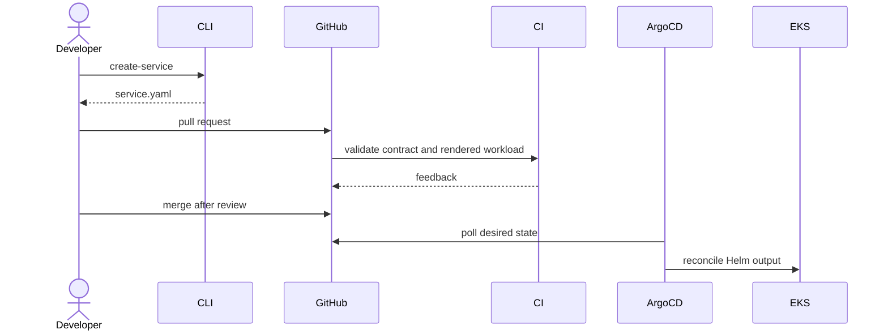

# Architecture

## Product boundary

The Service Definition is the product API. The CLI authors and checks it. Helm
translates it to standard namespaced resources. ApplicationSet discovers it and
creates a service-level Argo Application. EKS is a runtime dependency, not the
main product demonstrated by this repository.

## Control flow

Only the local part through render validation has been exercised in Phase 2.

## Ownership boundaries

| Layer | Owner | Mechanism |
| --- | --- | --- |
| VPC, EKS, node group, IAM, sample ECR | Platform | Terraform |
| Argo CD initial installation | Platform bootstrap | Helm command |
| Namespace, AppProject, ApplicationSet | Platform | Argo CD root Application |
| Workload templates | Platform | Golden Path chart |
| Service intent and app image | Application team | Service Definition |
| Runtime reconciliation | Argo CD | Git desired state |

Argo CD is not installed through Terraform because that would couple cluster
workload lifecycle to infrastructure state. A small bootstrap discontinuity is
accepted and documented.

## Failure domains

An Argo CD outage stops reconciliation and deployment visibility but does not
terminate already-running workloads. A broken service definition should affect
one generated Application. The Phase 2 AppProject restricts generated workloads
to `team-payments` and four namespaced resource kinds. Admission enforcement and
network boundaries remain Phase 3 work.
